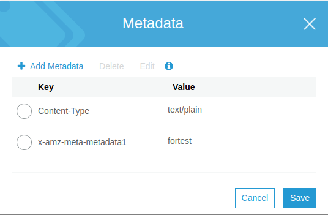

# This is the directory to store code regarding file upload to s3 bucket.

* **Print the help information**   
```
python s3upload.py --help 
```   

* **To upload file**
  * bucket : bucket name on s3
  * username : user who is uploading
  * password : user password
  * project : the project that the file within
  * path : the path to the file 
  * metadata1 : the metadata defined by user
```
python s3upload.py --bucket trigger20190809 --username testusername --password setpassword --project project1 --path /home/tgao/tgao2019/platform/test/unittest/large_file_600M.py --metadata1 fortest
```

 
* **When the file is smaller then 100MB, the program will not print progress.**
* **The example output**  
  * uploading small file   
  
  * uploading large file   
   
  * metadata    
   
  * result     

